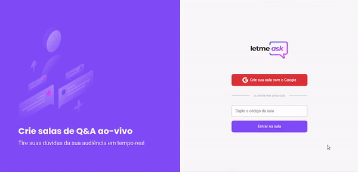

<h3 align="center">
    
</h3>

<p align="center"> :tada: <strong>Leatmeask - 6º NLW</strong> 🚧</p>
 
<p align="center">
   
  
  <a href="https://github.com/savio-2-lopes"> 
    
  </a>
 
 <a href="https://github.com/savio-2-lopes">
    
  </a>  
</p>

<br>

## :pushpin: Índice

- [Sobre](#sobre-o-projeto)
- [layout](#layout)
- [Como executar](#executar)
- [Tecnologias](#tecnologia)
- [Licença](#licenca)
- [Autor](#autor)
- [Agradecimentos](#agradecimentos)

<br>

<a id="sobre-o-projeto"></a>

## 💻 Sobre o projeto

:speech_balloon: Plataforma para criar salas de Q&A (perguntas e respostas). 

Projeto desenvolvido durante a **6º edição da NLW - Next Level Week** da [Rocketseat](https://rocketseat.com.br/)

<br>

<a id="layout"></a>

## 🎨 Layout

<p align="center" style="display: flex; align-items: flex-start; justify-content: center;">
  
</p>

<br>

<a id="executar"></a>

## 🚀 Como executar o projeto

### Pré-requisitos

Antes de começar, você vai precisar ter instalado em sua máquina as seguintes ferramentas:
[Git](https://git-scm.com), [Node.js](https://nodejs.org/en/), uma conta no banco de dados [Firebase](https://firebase.google.com/?hl=pt) e o gerenciador de pacotes [Yarn](https://yarnpkg.com/).
Além disto é bom ter um editor para trabalhar com o código, como [VSCode](https://code.visualstudio.com/)

<br>

#### 🧭 Rodando o frontend

```bash

# Clone esse repositório
$ git clone https://github.com/savio-2-lopes/Letmeask.git

# Entre na pasta
$ cd Letmeask

# Crie um arquivo denominado .env.local e adicione os dados obtidos das configurações do Firebae

# Instale as depedências
$ yarn

# Rode o comando
$ yarn start

# A aplicação estará rodando na porta
$ http://localhost:3000/

```

<br>

<a id="tecnologia"></a>

## 🛠 Tecnologias

As seguintes ferramentas foram usadas na construção do projeto:

- [Firebase](https://firebase.google.com/?hl=pt/)
- [React.js](https://pt-br.reactjs.org/)
- [Typescript](https://www.typescriptlang.org/)

<br>

<a id="licenca"></a>

## :memo: Licença

Este projeto está sob a licença do MIT. Veja a [página de licença](https://opensource.org/licenses/MIT) para mais detalhes.

<br>

<a id="autor"></a>

## 🦸 Autor

[](https://github.com/savio-2-lopes) 
[](https://www.instagram.com/savioaugulopes/) 
[](https://www.linkedin.com/in/savio-lopes/) 
[](mailto:savio.dev.lopes@gmail.com) 

Feito com ❤️ por Savio Lopes 👋🏽 [Entre em contato!](https://www.linkedin.com/in/savio-lopes/)

<br>

<a id="agradecimento"></a>

## 💙 Agradecimentos

Obrigado [Rocketseat](https://rocketseat.com.br/) por disponibilizar esse conteúdo sensacional 🚀.
